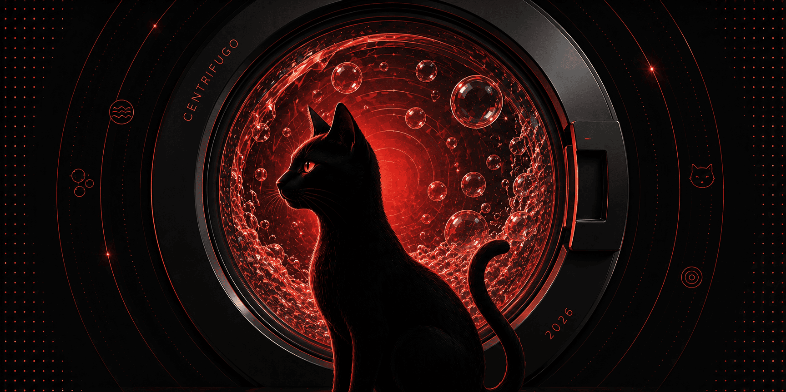

Centrifugal Labs powers real-time magic 🔮

Our flagship product is Centrifugo — a self-hosted real-time messaging server that is stack-agnostic and integrates with any frontend or backend technology. Centrifugo enables you to easily build real-time features such as chats, live updates, multiplayer games, collaborative tools, real-time dashboards, and streaming AI responses.

Centrifugo delivers messages to connected clients in real time over WebSocket, Server-Sent Events (SSE), HTTP streaming, WebTransport, or gRPC. Clients subscribe to channels, while the server implements efficient publish/subscribe semantics with built-in support for stream recovery, presence, delta compression, flexible authentication schemes, and detailed observability.

Centrifugo scales horizontally out of the box and is used in production environments with millions of concurrent connections. It supports both JSON and binary Protobuf protocols for maximum performance and efficiency.

Official client SDKs are available for JavaScript/TypeScript, Swift, Java (Android), C#, Dart (Flutter), Python, and Go. These SDKs handle the heavy lifting for you — including seamless reconnects, subscription multiplexing over a single connection, timeout management, and ping-pong logic.

